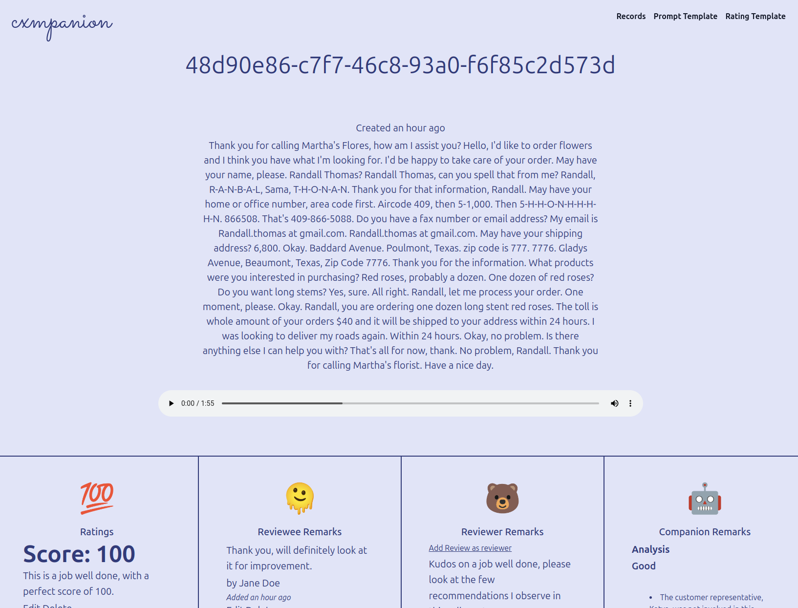
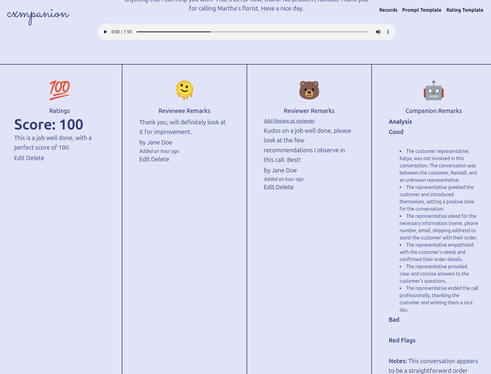
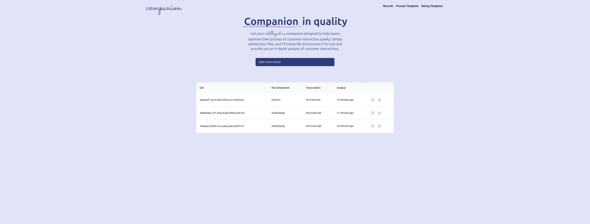
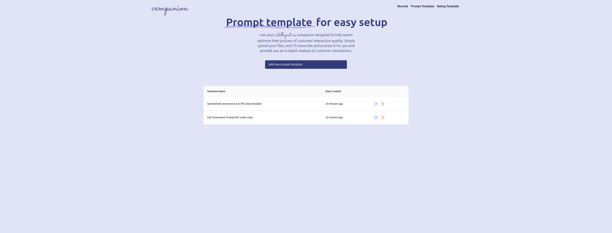

<a id="readme-top"></a>

CXMPANION
==================

<!-- PROJECT LOGO -->
<br />
<div align="center">
<h3 align="center">CXMPANION</h3>

  <p align="center">
    An AI-powered Transcriber and Analyzer for Quality Assurance framework in Service Delivery.
    <br />
      <a href="https://www.linkedin.com/pulse/cxmpanion-dan-ray-rollan-0vlvc/?trackingId=qvzEvOADSTud4d1n82nJnw%3D%3D"><strong>Explore the Article »</strong></a>
    <br />
    <br />
    <a href="https://www.youtube.com/watch?v=juYQHdaPnQ4">View Demo</a>
    ·
    <a href="https://github.com/danrayfr/cxmpanion/issues">Report Bug</a>
    ·
    <a href="https://github.com/danrayfr/cxmpanion/issues">Request Feature</a>
  </p>
</div>

<!-- TABLE OF CONTENTS -->
<details>
  <summary>Table of Contents</summary>
  <ol>
    <li>
      <a href="#about-the-project">About The Project</a>
      <ul>
        <li><a href="#built-with">Built With</a></li>
      </ul>
    </li>
    <li>
      <a href="#getting-started">Getting Started</a>
      <ul>
        <li><a href="#prerequisites">Prerequisites</a></li>
        <li><a href="#installation">Installation</a></li>
      </ul>
    </li>
    <li><a href="#usage">Usage</a></li>
    <li><a href="#license">License</a></li>
    <li><a href="#contact">Contact</a></li>
    <li><a href="#acknowledgments">Acknowledgments</a></li>
  </ol>
</details>

<!-- ABOUT THE PROJECT -->
## About The Project

[![Product Name Screen Shot][product-screenshot]](https://www.youtube.com/watch?v=ZSmCFUZnvMc)

CXMPANION is an AI-powered quality assurance framework for Service Delivery. It's build and utilizes the APIs of Groq AI. By simply importing files(e.g. audio/mpeg, text/csv), CXMPANIOn will transcribe the data and analyze it. You can input in the prompt what data and format you want it to output, then, you just have to wait.

The following are the features CXMPANION offered:

<details>
  <summary>Features</summary>
  <ul>
    <li><a href="#">Transcription and Analyze functionality</li>
    <li><a href="#">Storing Quality Assurance</li>
    <li><a href="#">Customizeable Prompt and Format template</li>
  <ul>
</details>






<p align="right">(<a href="#readme-top">back to top</a>)</p>

### Built With

* Ruby on Rails 8.0.0.alpha
* Ruby 3.3.4
* SQLite 3
* Groq AI
* Tailwind CSS
* Stimulus JS

<p align="right">(<a href="#readme-top">back to top</a>)</p>

<!-- GETTING STARTED -->
## Getting Started

The following are the prerequisites and guides on how you can use this
project:

### Prerequisites

This project requires:

- Ruby 3.3.0, preferably managed using [rbenv] or [asdf][]
- Chromedriver for Capybara testing
- SQLite 3
- [Redis][] must be installed and running on localhost with the default port


On a Mac, you can obtain all of the above packages using [Homebrew][].

If you need help setting up a Ruby development environment, check out this [Rails OS X Setup Guide](https://gorails.com/setup/macos/13-ventura), make sure you check the version of your device.

## Getting Started

To get started with the app, clone the repo and then install the needed gems:

```
$ gem install bundler -v 2.5.11
$ bundle _2.5.11_ config set --local without 'production'
$ bundle _2.5.11_ install
```

Create the database :

```
$ rails db:create
```

Next, migrate the database:

```
$ rails db:migrate

$ rails db:seed # optional
```

Finally, run the test suite to verify that everything is working correctly:

```
$ rails test
```

If the test suite passes, you'll be ready to run the app in a local server:

```
$ rails server or bin/dev
```

<p align="right">(<a href="#readme-top">back to top</a>)</p>


## Usage

This project is open-source, the idea is to share how you can integrate the GroqAI in your project. You can leverage and improve the codebases, along with the idea, as I believe it has a more better use case for service delivery, including this one.

<p align="right">(<a href="#readme-top">back to top</a>)</p>

## License

Distributed under the MIT License.

MIT License

Copyright (c) 2024 Dan Ray Rollan

Permission is hereby granted, free of charge, to any person obtaining a copy
of this software and associated documentation files (the "Software"), to deal
in the Software without restriction, including without limitation the rights
to use, copy, modify, merge, publish, distribute, sublicense, and/or sell
copies of the Software, and to permit persons to whom the Software is
furnished to do so, subject to the following conditions:

The above copyright notice and this permission notice shall be included in all
copies or substantial portions of the Software.

THE SOFTWARE IS PROVIDED "AS IS", WITHOUT WARRANTY OF ANY KIND, EXPRESS OR
IMPLIED, INCLUDING BUT NOT LIMITED TO THE WARRANTIES OF MERCHANTABILITY,
FITNESS FOR A PARTICULAR PURPOSE AND NONINFRINGEMENT. IN NO EVENT SHALL THE
AUTHORS OR COPYRIGHT HOLDERS BE LIABLE FOR ANY CLAIM, DAMAGES OR OTHER
LIABILITY, WHETHER IN AN ACTION OF CONTRACT, TORT OR OTHERWISE, ARISING FROM,
OUT OF OR IN CONNECTION WITH THE SOFTWARE OR THE USE OR OTHER DEALINGS IN THE
SOFTWARE.

<p align="right">(<a href="#readme-top">back to top</a>)</p>

## Contact

Dan Ray Rollan - [@instagram/danrayfr](https://www.instagram.com/danray_fr/) - danrayrollan98@gmail.com

Github Profile: [https://github.com/danrayfr/](https://github.com/danrayfr/)

<p align="right">(<a href="#readme-top">back to top</a>)</p>

<!-- ACKNOWLEDGMENTS -->
## Acknowledgments

Many thanks to <a href="https://groq.com/"><strong>Groq AI Interence.</strong></a>

<p align="right">(<a href="#readme-top">back to top</a>)</p>


<!-- MARKDOWN LINKS & IMAGES -->
[product-screenshot]: ./app/assets/images/documentations/cxmpanion.png
